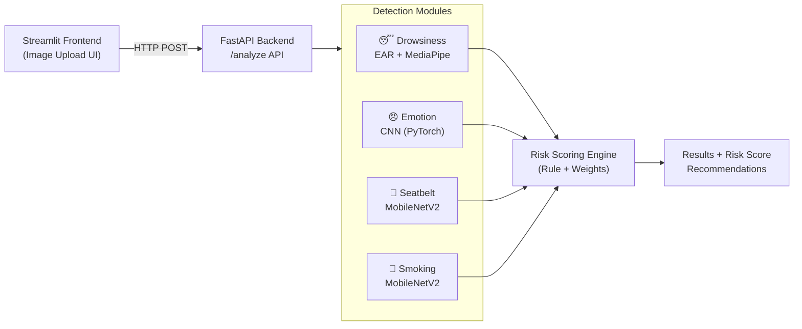

# 🚗 Driver Risk Assessment System using Computer Vision & Deep Learning

*An end-to-end AI system to analyze driver behavior and assess real-time driving risk using multiple vision-based safety signals.*

---

## 📌 Project Overview

Road accidents are often caused by a combination of driver fatigue, distraction, emotional stress, and safety negligence (such as not wearing a seatbelt or smoking while driving). This project aims to **analyze driver behavior from images** and compute an **overall driver risk score** by combining multiple detection modules into a single intelligent system.

The system is designed as a **modular, extensible safety analytics platform**, inspired by real-world fleet safety solutions, and implemented using modern **Deep Learning, Computer Vision, and backend APIs**.

---

## 🎯 Key Objectives

* Detect multiple risky driver behaviors from a single input image
* Use the most suitable technique for each problem (ML, DL, or rule-based logic)
* Combine model outputs into a unified **Driver Risk Score (0–100)**
* Provide a clean, interactive UI for analysis and verification
* Build an end-to-end pipeline suitable for real-world deployment

---

## 🖼️ Demo Preview

The Streamlit interface allows users to:

* Upload a driver image
* Visually verify the uploaded image


* View individual detection results with confidence scores
* See the final **Driver Risk Assessment** in a clear, human-readable format


### ⚠️ Driver Risk Assessment Engine

#### Instead of showing only individual ML predictions, the system combines all module outputs into a single Driver Risk Score (0–100).

**Example Output**

⚠️ Risk Assessment
Risk Score: 100/100

HIGH RISK 🚨
Immediate attention required! Multiple high-risk behaviors detected.

💡 Recommendations
• Suggest taking a break
• Remind about no-smoking policy
• Fasten seatbelt immediately
• Check emotional state before driving

**How the Risk Score Works (High-Level)**

- Each unsafe behavior contributes a weighted score

- Additional logical rules increase risk for dangerous combinations

**Examples:**

- Drowsy or Possibly Drowsy → high risk

- No seatbelt → critical risk

- Angry emotion + No seatbelt → extra risk

- Smoking while driving → elevated distraction risk

- The final score is mapped to:

🟢 LOW RISK

🟠 MEDIUM RISK

🔴 HIGH RISK

---

## 🧩 System Architecture (High Level)



1. User uploads an image via Streamlit UI
2. Image is sent to FastAPI backend
3. Multiple detection modules analyze the image independently
4. Outputs are aggregated using rule-based risk logic
5. Final risk score and explanations are returned to the UI

---

## 🛠️ Detection Modules & Technical Approach

This project intentionally uses **different approaches for different problems**, based on practicality, explainability, and data availability.

### 😴 Drowsiness Detection

**Approach:** Eye Aspect Ratio (EAR) – Geometry-based (No Neural Network)

* Uses facial landmarks to compute eye openness
* EAR value drops when eyes remain closed for a sustained period
* Threshold-based logic classifies driver as:

  * ALERT
  * POSSIBLY DROWSY
  * DROWSY

**Why this approach?**

* Highly explainable
* No training data required
* Works well in real-time scenarios

---

### 🚬 Smoking Detection

**Approach:** MobileNetV2 (Transfer Learning)

* Binary image classification: `smoking` vs `not_smoking`
* Fine-tuned lightweight CNN for fast inference
* Suitable for edge and real-time systems

---

### 🦺 Seatbelt Detection

**Approach:** MobileNetV2 (Transfer Learning)

* Detects whether the driver is wearing a seatbelt
* High accuracy due to strong visual cues
* Integrated as an independent safety module

---

### 😠 Emotion Detection

**Approach:** CNN-based facial emotion recognition

* Predicts dominant facial emotion (e.g., Angry, Neutral, Happy)
* Confidence scores are displayed to reflect uncertainty

**Note:**
Emotion detection is treated as a **supporting signal**, not a standalone risk indicator.

---

## ⚠️ Driver Risk Scoring Logic

Instead of training another ML model, a **rule-based weighted scoring system** is used to compute overall risk.

Each detection contributes a predefined weight:

* Drowsy / Possibly Drowsy → High risk contribution
* Smoking → Medium risk contribution
* No Seatbelt → High risk contribution
* Angry Emotion → Supporting risk signal

### Compound Risk Logic

Additional risk is added when **multiple dangerous behaviors occur together** (e.g., angry + no seatbelt).

The final score is:

* Capped between **0 and 100**
* Categorized as:

  * LOW RISK
  * MODERATE RISK
  * HIGH RISK 🚨

---

## 🧪 Observations & Limitations

* Some edge cases fail due to lighting or face occlusion
* Emotion confidence may vary depending on facial clarity
* Image-based analysis does not capture temporal behavior (future enhancement)

---

## 🧰 Tech Stack

* Python
* PyTorch
* OpenCV
* MediaPipe
* FastAPI
* Streamlit
* NumPy
* PIL


---

## 🚀 How to Run Locally

```bash
pip install -r requirements.txt
uvicorn api.main:app --reload
streamlit run streamlit_app/app.py
```

---


## 🚧 Project Scope & Real-World Use Case

### Current Scope (This Project)

- Image-based driver analysis

- Single image upload via Streamlit

- Backend inference via FastAPI

**Outputs:**

- Individual detections

- Unified risk score

- Safety recommendations

**⚠️ This project is intentionally built as a prototype / proof-of-concept, not a production system.**

---

### Intended Real-World Use Case

**In a production environment, this system could be extended to:**

- 📹 Live video stream processing from dashcams

- 🎞️ Frame-by-frame driver monitoring

- 🚗 Fleet-level safety analytics

- 🚨 Real-time alerts sent to:

    - Vehicle owner

    - Fleet manager

    - Traffic control center

- 📊 Continuous driver risk profiling over time

---

## 🔮 Future Enhancements

**Planned extensions (not implemented in this version):**

- Overspeeding detection

- Traffic signal violation detection

- Mobile phone usage detection

- Multi-driver tracking in video feeds

- Real-time alerting system

- Cloud deployment with scalable inference

- Dashboard for historical risk analytics

---

## 📌 Conclusion

This project demonstrates how multiple AI techniques can be combined into a **single intelligent safety system**, focusing not only on model accuracy but also on **system design, explainability, and real-world applicability**.
